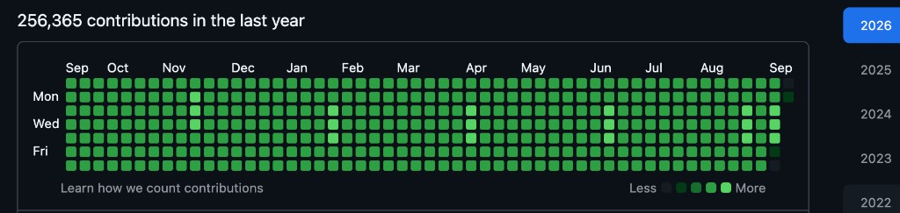
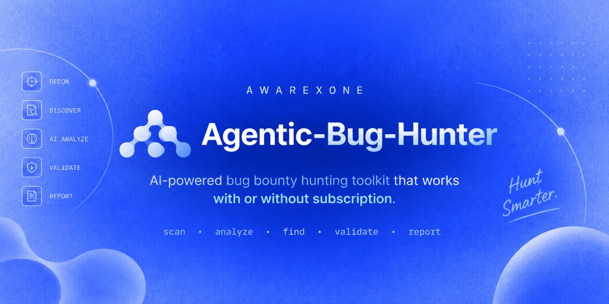

<p align="center">
  
</p>

# AXguard

> **Open-source AI security tool to scan and fix vulnerabilities in your vibe-coded apps before you ship.**
>
> **AXguard by [AwareXone](https://awarexone.com/)**

### Built by [Shuvonsec](https://github.com/shuvonsec)

AXguard is built by **[Shuvonsec](https://github.com/shuvonsec)** — Ethical hacker and security researcher. He ranked **#1 worldwide** on the TryHackMe monthly leaderboard in 2025. He works on AI security and cybersecurity agents, and builds open-source tools to make AI-built applications safer.

<p align="center">
  <a href="https://github.com/shuvonsec">
    
  </a>
</p>

<p align="center">
  <a href="https://github.com/shuvonsec"></a>
  <a href="https://shuvonsec.com"></a>
  <a href="https://awarexone.com/"></a>
</p>

[](LICENSE)
[](https://www.python.org/)
[](#)
[](https://github.com/Awarexone/AXguard/actions/workflows/ci.yml)
[](https://github.com/Awarexone/AXguard/actions/workflows/codeql.yml)
[](https://scorecard.dev/viewer/?uri=github.com/Awarexone/AXguard)
[](https://claude.ai/claude-code)
[](https://cursor.com/)

**CLI + AI agent plugin for Claude Code, Cursor, OpenCode, Codex, and more.**

[Website](https://awarexone.com/) · [GitHub](https://github.com/Awarexone) · [X](https://x.com/awarexone) · [Dev Docs](DEV.md)

**Contact:** [hello@awarexone.com](mailto:hello@awarexone.com) · [b2b@awarexone.com](mailto:b2b@awarexone.com) · [shuvon@awarexone.com](mailto:shuvon@awarexone.com)

---

## What is AXguard?

**AXguard is a pre-ship security gate.**

Before you publish an app — especially one built with AI — AXguard checks your code for common security problems, helps you fix them, and creates clear security reports.

It can find:

* Leaked secrets and API keys
* Broken authentication and access control
* IDOR
* Injection and RCE
* SSRF
* XSS
* Cloud misconfigurations
* AI-agent and LLM risks

```text
AI builds it → AXguard checks it → You fix it → You ship it
```

Works as a **standalone CLI** and as an **AI-agent plugin**.

---

## Why AXguard?

AI tools can build an app in minutes.

They can also ship security bugs in minutes.

AXguard sits between:

```text
"the AI built it"
        ↓
     AXguard
        ↓
"we shipped it"
```

Built for developers, founders, security engineers, and teams that want a simple security checkpoint — without a heavy enterprise setup.

---

## Quick Start

### 1. Install the plugin

```bash
git clone https://github.com/Awarexone/AXguard.git
cd AXguard

chmod +x install.sh uninstall.sh
./install.sh
```

For Cursor:

```bash
./install.sh --agent cursor
```

For all supported agents:

```bash
./install.sh --agent all
```

Supports **Claude Code, Cursor, OpenCode, Codex, and shared Agent Skills**.

### 2. Install the CLI

```bash
python3 -m venv .venv
source .venv/bin/activate

pip install -e .

axguard help
axguard audit .
```

Open the report:

```bash
open .findings/axguard/axguard-report.html
```

| | |
|---|---|
| Package | `axguard` |
| Version | `0.2.0` |
| Python | `3.10+` |
| License | MIT |

---

## Start Using AXguard

> **Start with the workflow you need, not the full list.**

| What are you doing? | Start here |
|---|---|
| About to ship | `/axguard-audit` |
| Quick check while coding | `/axguard-scan` |
| New or unknown codebase | `/axguard-threat-model` |
| AI-generated app | `/axguard-agent` |
| Looking for leaked keys | `/axguard-secrets` |
| Auth / IDOR issues | `/axguard-auth` |
| Injection / RCE | `/axguard-inject` |
| SQL injection | `/axguard-sql` |
| SSTI | `/axguard-ssti` |
| Path traversal / LFI | `/axguard-path` |
| SSRF | `/axguard-ssrf` |
| XSS | `/axguard-xss` |
| Cloud / CORS | `/axguard-cloud` |
| Crypto misuse | `/axguard-crypto` |
| Supply chain | `/axguard-supply` |
| GraphQL | `/axguard-graphql` |
| File upload | `/axguard-upload` |
| Debug / error leaks | `/axguard-debug` |
| Too many findings | `/axguard-triage` |
| Fix confirmed bugs | `/axguard-fix` |
| Need a report | `/axguard-report` |
| Add a CI gate | `/axguard-ci` |
| GitHub PR bot (self-host) | `axguard github setup` → [docs/github](docs/github/README.md) |
| Full security-lead pass | `axguard-cso` |

See the [command cheat sheet](COMMANDS-QUICK-REF.md).

---

## GitHub Security Bot

Optional GitHub App adapter: review PRs with Check Runs + one updatable summary
comment. Runs AXGuard Core behind a thin webhook adapter (`engines/github/`).
Local CLI scanning does **not** require it.

```bash
axguard github setup .
axguard github validate .
axguard github test .
axguard github status .
```

- Install & permissions: [docs/github/install.md](docs/github/install.md) · [docs/github/permissions.md](docs/github/permissions.md)
- Config (new `.axguard.yml`): [docs/github/config.md](docs/github/config.md)
- Self-host (preferred): [docs/github/self-hosting.md](docs/github/self-hosting.md)
- Privacy / AI: [docs/github/privacy.md](docs/github/privacy.md) · [docs/github/ai-providers.md](docs/github/ai-providers.md)
- Architecture research: [docs/research/github-security-bot.md](docs/research/github-security-bot.md)
- Marketplace prep only (no approval claimed): [docs/github/marketplace.md](docs/github/marketplace.md)

---

## Commands & Specialists

Each command has a clear job.

| Command | Specialist | What it does |
|---|---|---|
| `/axguard-audit` | Pre-ship Lead | Full audit + HTML / MD / JSON report |
| `/axguard-scan` | Scanner | Fast check while you code |
| `/axguard-threat-model` | CSO | Map risks before a deep scan |
| `/axguard-secrets` | Secrets Hunter | Find keys and credentials |
| `/axguard-auth` | Access Control | Auth, IDOR, JWT, CSRF |
| `/axguard-inject` | Injection Hunter | Injection and RCE patterns |
| `/axguard-sql` | SQL Hunter | SQL / ORM injection sinks |
| `/axguard-ssti` | Template Hunter | Server-side template injection |
| `/axguard-path` | Path Hunter | Traversal / LFI / dynamic includes |
| `/axguard-ssrf` | Egress Hunter | Unsafe outbound requests |
| `/axguard-xss` | Client Security | Dangerous XSS sinks |
| `/axguard-cloud` | Cloud Reviewer | Cloud and CORS issues |
| `/axguard-crypto` | Crypto Reviewer | Weak hashing, hard-coded keys, TLS verify-off |
| `/axguard-supply` | Supply Chain | Install hooks, curl\|sh, untrusted indexes |
| `/axguard-graphql` | GraphQL Reviewer | Introspection / CSRF footguns |
| `/axguard-upload` | Upload Hunter | Unsafe file upload patterns |
| `/axguard-debug` | Debug Hunter | DEBUG mode, stack traces, actuators |
| `/axguard-agent` | Agent Security | AI-agent and LLM risks |
| `/axguard-triage` | Triage Lead | Cut noise, keep real issues |
| `/axguard-fix` | Remediation | Fix and re-check |
| `/axguard-report` | Report Author | Clean security reports |
| `/axguard-ci` | Release Gate | Fail CI on high / critical |
| `axguard-cso` | Chief Security Officer | End-to-end security pass |
| `axguard-preship` | Release Reviewer | Short pre-ship checklist |

---

## Which workflow?

| Situation | Start with | Then |
|---|---|---|
| Shipping soon | `/axguard-audit` | `/axguard-triage` → `/axguard-fix` |
| AI-built app | `/axguard-agent` | `/axguard-audit` |
| Auth-heavy API | `/axguard-auth` | `/axguard-audit` |
| New codebase | `/axguard-threat-model` | `/axguard-audit` |
| Noisy results | `/axguard-triage` | `/axguard-fix` |
| Need a shareable report | `/axguard-report` | Open the HTML |
| Want CI protection | `/axguard-ci` | Add it to your pipeline |

---

## CLI

**No AI agent required.**

```bash
axguard help
axguard version
axguard scan .
axguard audit .
axguard audit . --fail-on high
axguard scan . --format json -o out.json
open .findings/axguard/axguard-report.html

# Diagnostics (not vuln reports): surface → flow → verify → adversary → evidence → paths
axguard surface .
axguard flow .
axguard verify .
axguard adversary .
axguard evidence .
axguard paths .    # attack graph + vuln chaining (alias: axguard attack-paths .)

# GitHub Security Bot (optional adapter)
axguard github setup .
axguard github validate .
axguard github status .
```

On top of `axguard paths`, `engines/attack_graph/aggregate.py` and
`engines/attack_graph/posture.py` add optional, importable rollups (risk
aggregation grouped by root cause/asset/privilege/tenant, and an
`Entry → Trust → Controls → Weak → Vulns → Priv → Assets → Impact` posture
summary) — see [`commands/axguard-paths.md`](commands/axguard-paths.md).

---

## What it finds

| Area | Examples |
|---|---|
| **Secrets** | API keys, AWS credentials, GitHub/Slack tokens, PEM blocks |
| **Auth** | IDOR, weak JWT, decode-without-verify, CSRF gaps |
| **Injection** | `eval`, `exec`, `pickle.loads`, `shell=True`, `os.system` |
| **SQL / NoSQL** | String-built queries, raw ORM SQL, Mongo operator injection |
| **SSTI** | `render_template_string`, dynamic Pug/Jinja compile |
| **Path / LFI** | User paths in `open`/`send_file`/`include` |
| **SSRF** | User-controlled URLs, metadata IPs |
| **XSS** | `innerHTML`, `document.write`, React HTML sinks |
| **Upload** | Client filenames, unrestricted multer |
| **Crypto** | Hard-coded keys, MD5 passwords, TLS verify off |
| **Supply chain** | `curl \| sh`, risky install scripts, extra indexes |
| **GraphQL** | Introspection on, CSRF prevention off |
| **Debug** | Django/Flask debug, stack traces, open actuators |
| **Cloud** | Metadata URLs, wildcard CORS, public S3 ACL |
| **AI agents** | Running model output, unrestricted shell tools |

---

## Reports

Every full audit writes three files:

```text
.findings/axguard/
├── axguard-report.html   # easy to read
├── axguard-report.md     # for PRs and docs
└── axguard-report.json   # for CI and tools
```

---

## CI / Release Gate

Add AXguard to your release process:

```text
Code → AXguard → High/Critical?
                 ├── Yes → Fix → Re-scan
                 └── No  → Ship
```

Example:

```bash
axguard audit . --fail-on high
```

---

## Built for vibe-coded apps

AI can generate an app quickly. Security review should still happen before you publish.

```text
AI builds it
     ↓
AXguard checks it
     ↓
You fix it
     ↓
AXguard checks again
     ↓
You ship it
```

Use `/axguard-agent` when the app gives models access to shells, files, APIs, or tools.

---

## AwareXone

AXguard is built by **[AwareXone](https://awarexone.com/)**.

We build open-source security tools for the AI era — for people who **build** and people who **hunt**.

```text
BUILD                         HUNT
  │                             │
AXguard                 Agentic Bug Hunter
  │                             │
Secure what you create   Find bugs that are live
```

> **Same security DNA. Different job.**

### Agentic Bug Hunter

<p align="center">
  <a href="https://github.com/Awarexone/Agentic-Bug-Hunter">
    
  </a>
</p>

**AI-powered bug bounty toolkit** ([4.8k+ stars](https://github.com/Awarexone/Agentic-Bug-Hunter)).

Point it at a live target. It helps you recon, find vulnerabilities, validate findings, and write reports. Claude Code plugin + standalone `bughunter` CLI.

→ [github.com/Awarexone/Agentic-Bug-Hunter](https://github.com/Awarexone/Agentic-Bug-Hunter)

### More from AwareXone

| Tool | What it is |
|---|---|
| [**Agentic Bug Hunter**](https://github.com/Awarexone/Agentic-Bug-Hunter) | AI bug bounty toolkit |
| [**Public Skills Builder**](https://github.com/Awarexone/public-skills-builder) | Turn public security research into reusable skills |
| [**Web3 Bug Bounty AI Skills**](https://github.com/Awarexone/web3-bug-bounty-hunting-ai-skills) | Smart-contract and DeFi security skills |

[awarexone.com](https://awarexone.com/) · [GitHub](https://github.com/Awarexone) · [X @AwareXone](https://x.com/awarexone)

Beyond open-source tools, AwareXone also builds AI-driven defenses against scams, fraud, and social engineering, and provides human-risk security services for organizations.

| | |
|---|---|
| General | [hello@awarexone.com](mailto:hello@awarexone.com) |
| Business / B2B | [b2b@awarexone.com](mailto:b2b@awarexone.com) |
| Founder | [shuvon@awarexone.com](mailto:shuvon@awarexone.com) |

→ [Get in touch](https://awarexone.com/)

---

## Developer Docs

| Doc | For |
|---|---|
| [DEV.md](DEV.md) | Setup and day-to-day development |
| [docs/architecture.md](docs/architecture.md) | How the scanner works |
| [docs/github/README.md](docs/github/README.md) | GitHub Security Bot (App adapter) |
| [docs/adding-rules.md](docs/adding-rules.md) | Adding detections |
| [docs/plugin.md](docs/plugin.md) | Agent plugin setup |
| [docs/SKILL-SCHEMA.md](docs/SKILL-SCHEMA.md) | Domain skill frontmatter + sections |
| [docs/SECURITY-KNOWLEDGE-INVENTORY.md](docs/SECURITY-KNOWLEDGE-INVENTORY.md) | Knowledge-layer inventory |
| [skills/index.yaml](skills/index.yaml) | Skill registry (30 core + orchestration) |
| [references/](references/) | Framework / repo / dataset provenance |
| [CONTRIBUTING.md](CONTRIBUTING.md) | Contributing to AXguard |
| [CONTRIBUTORS.md](CONTRIBUTORS.md) | Contributors |
| [skills/axguard-knowledge/](skills/axguard-knowledge/SKILL.md) | Vuln-class knowledge pack |

---

## Security knowledge layer

AXguard pairs a **deterministic CLI scanner** with a **research-backed skill system** so agents can reason, not just match regexes.

```text
Frameworks (OWASP / CWE / …)
        ↓
references/ (provenance index)
        ↓
skills/security/* (30 core domain skills)
        ↓
skills/axguard-* (orchestration: audit → triage → fix → report)
        ↓
commands/ + rules/ + CLI
```

- **Orchestration skills** drive workflows (`/axguard-audit`, triage, remediate).
- **Domain skills** teach source→sink analysis, evidence gates, FP controls, and fixes per class (SSRF, SQLi, authZ, prompt injection, MCP, …).
- **Provenance** lives in `references/` — cite official IDs only; no invented CWE/OWASP mappings; HF datasets are metadata/derived-knowledge only.
- Validate with: `python scripts/validate_skills.py`

---

## Security checks

AXGuard checks *your* apps before ship. This repository also runs automated
checks on itself:

| Check | Workflow |
|---|---|
| CI tests + fixture self-scan | [`ci.yml`](.github/workflows/ci.yml) |
| CodeQL (Python) | [`codeql.yml`](.github/workflows/codeql.yml) |
| Secret detection (Gitleaks) | [`gitleaks.yml`](.github/workflows/gitleaks.yml) |
| Dependency vulns (OSV-Scanner) | [`osv-scanner.yml`](.github/workflows/osv-scanner.yml) |
| Actions audit (zizmor) | [`zizmor.yml`](.github/workflows/zizmor.yml) |
| OpenSSF Scorecard | [`scorecard.yml`](.github/workflows/scorecard.yml) |
| Dependency updates | [Dependabot](.github/dependabot.yml) |

Report vulnerabilities in AXGuard via [SECURITY.md](.github/SECURITY.md)
(GitHub Private Vulnerability Reporting preferred).

---

## Contributing

Contributions are welcome.

Help with:

* Detection rules
* Scanners
* Test fixtures
* Agent skills
* Reports
* Documentation
* Bug fixes

```bash
pip install -e ".[dev]"
pytest -q
axguard audit fixtures/vuln_app --no-banner
```

See [CONTRIBUTING.md](CONTRIBUTING.md).

---

## Responsible Use

AXguard is for **authorized security testing and defense**.

Only scan systems, applications, repositories, and infrastructure that you own or have permission to test.

---

## Support

AXguard is free and open source.

If it helps you build safer software, a **star on GitHub** helps more builders find it.

You can also support the project and help fund more open-source security tools.

**Website:** [awarexone.com](https://awarexone.com/)  
**Email:** [hello@awarexone.com](mailto:hello@awarexone.com) · [b2b@awarexone.com](mailto:b2b@awarexone.com) · [shuvon@awarexone.com](mailto:shuvon@awarexone.com)  
**Buy Me a Coffee:** [buymeacoffee.com/shuvonsec](https://www.buymeacoffee.com/shuvonsec)

| | |
|---|---|
| **Bitcoin** | `1GXwGqmLcnbZWgVNskUAZyw2cmqenkUFNY` |
| **Solana** | `4ArkPu1E7tkrt3d5X84grWzF1xjuLpScgGEy12Bp2cmE` |

---

## License

MIT. See [LICENSE](LICENSE).

<!--
SEO: ai-security · vibe-coding · security-scanner · vulnerability-scanner ·
appsec · devsecops · ai-agent-security · llm-security · sast · owasp ·
secret-scanning · claude-code · cursor · awarexone
-->
